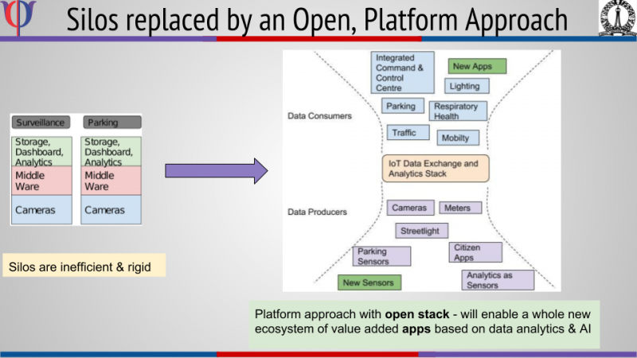
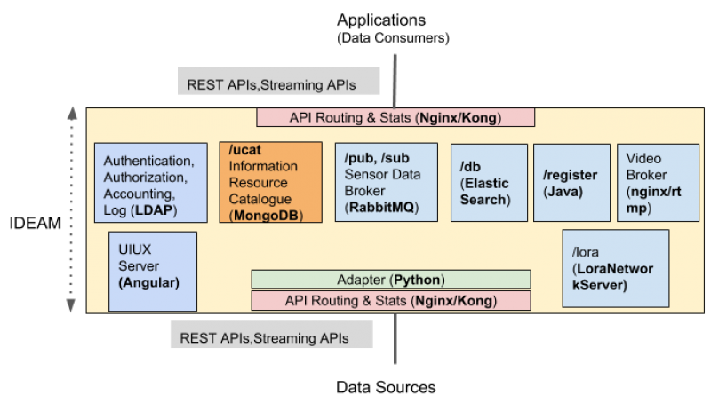

=================================================================
City Data Exchange & Analytics Middleware (CDX) for Smart Cities
=================================================================

.. image:: https://travis-ci.org/rbccps-iisc/ideam.svg?branch=master
    :target: https://travis-ci.org/rbccps-iisc/ideam

Architecture
============

Resources
=========
- About: http://www.rbccps.org/smart-city/
- Extensive Documentation: https://cdx.readthedocs.io/en/latest/

Getting Started
-------------

This guide will help you to quickly get started with a single node instance of CDX and start publishing data from a device.

#. Install Docker ::

    sudo apt-get install docker.io

#. Add permission to user ::

    sudo usermod -a -G docker $USER

#. Logout and log back in.

#. Run ``ifconfig`` and note down the name of the interface you're connected to.

    .. image:: ifconfig.png
       :width: 550px
       :align: center
       :height: 250px
       :alt: alternate textI
  
   In the above example the interface name is ``enp9s0``

#. Now run::

    sudo nmcli device show enp9s0

   Replace ``enp9s0`` with your respective interface name. The output should be something like this

   .. image:: nmcli.png
       :width: 700px
       :align: center
       :height: 175px
       :alt: alternate textI
   
   Note down the DNS from ``IP4.DNS`` section

#. Add DNS obtained in the previous step to the file ``/etc/docker/daemon.json`` If the file does not exist, create it. The entry should look something like this ::

    {"dns": ["8.8.8.8", "8.8.4.4"]}

   Add the obtained DNS to the above JSON array. So the final entry should look something like this::

    {"dns": ["8.8.8.8","8.8.4.4","168.95.1.1"]}

   Of course, the DNS would change according to your network.

#. Add DNS in ``/etc/default/docker`` file as follows::

    DOCKER_OPTS="--dns 8.8.8.8 --dns 8.8.4.4 --dns 168.95.1.1"

#. Restart Docker ::

    service docker restart

CDX Installation
----------------

#. Clone CDX git repo ::

    git clone https://github.com/rbccps-iisc/ideam.git

   CDX repository comes with a default configuration file ``ideam.conf``::
  
    [APIGATEWAY]
    https = 8443

    [BROKER]
    http = 12080
    management = 12081
    amqp = 12082
    mqtt = 12083

    [ELASTICSEARCH]
    kibana = 13081

    [WEBSERVER]
    http = 14080
    
    [LDAP]
    ldap = 15389
    
    [CATALOGUE]
    http = 16080
    
    [KONGA]
    http = 17080
    
    [VIDEOSERVER]
    rtmp = 18935
    hls = 18080
    http = 18088
    
    [PASSWORDS]
    ldap = ? 
    broker = ? 
    cdx.admin = ? 
    database = ?

   This file contains details about the ports used by different microservices. It also allows the user to configure passwords that should be used for certain services during 
   installation. By default, the password fields in the config file is set to ``?``, which indicates that the system will generate random passwords during runtime.
   
#. Install CDX ::

    cd ideam/
    ./install

Registering your first device
-----------------------------
* Once CDX has installed you can now start registering devices with it. Let's create a simple test device for the sake of illustration::
      
   sh tests/create_entity.sh testStreetlight

* This will give you the details of the registration

  .. code-block:: JSON

   {
     "Registration": "success",
     "entityID": "teststreetlight",
     "apiKey": "EHQilai5cF_tNmWOwg-oiPdncmRPdfGCIhFHM85zDDW",
     "subscriptionEndPoint": "https://smartcity.rbccps.org/api/{version}/followid=teststreetlight",
     "accessEndPoint": "https://smartcity.rbccps.org/api/{version}/db?id=teststreetlight",
     "publicationEndPoint": "https://smartcity.rbccps.org/api/{version}/publish?id=teststreetlight",
     "resourceAPIInfo": "https://rbccps-iisc.github.io"
   }     

Publishing from your device
---------------------------

* You can now publish data from this device using::

     sh tests/publish.sh teststreetlight EHQilai5cF_tNmWOwg-oiPdncmRPdfGCIhFHM85zDDW
  
  This will publish ``{"body": "testdata"}`` to the exchange ``teststreetlight.protected``

* That's it! You can similarly register more devices and apps with the middleware.

For detailed guides and resources visit https://cdx.readthedocs.io/en/latest/
